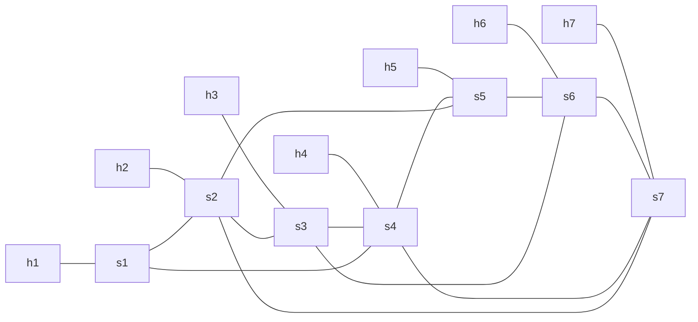

# Complex Topology Demo

This directory provides a larger Mininet topology for the shortest-path switching demo.

## Topology

The topology contains 7 hosts, 7 switches, and 18 links in total.

All hosts in this demo use the `10.0.0.0/24` subnet so the baseline connectivity test is not affected by the standalone firewall rules in `firewall_rule.json`.

- Host links: `h1-s1`, `h2-s2`, `h3-s3`, `h4-s4`, `h5-s5`, `h6-s6`, `h7-s7`
- Switch links: `s1-s2`, `s2-s3`, `s3-s4`, `s4-s5`, `s5-s6`, `s6-s7`, `s1-s4`, `s2-s5`, `s3-s6`, `s4-s7`, `s2-s7`



## Expected Shortest Paths

The controller uses Dijkstra over an unweighted graph, so shortest paths are counted by link hops.

- `h1 -> h4`: `h1 -> s1 -> s4 -> h4`
- `h1 -> h7`: `h1 -> s1 -> s2 -> s7 -> h7`
- `h2 -> h5`: `h2 -> s2 -> s5 -> h5`
- `h2 -> h7`: `h2 -> s2 -> s7 -> h7`
- `h3 -> h6`: `h3 -> s3 -> s6 -> h6`
- `h4 -> h7`: `h4 -> s4 -> s7 -> h7`
- `h5 -> h7`: `h5 -> s5 -> s2 -> s7 -> h7`

Other host pairs follow the same switch-level shortest-path rule and should be printed by the controller after topology discovery.

## Running

Start the controller first:

```bash
osken-manager --observe-links controller.py
```

Then start the complex topology in another terminal:

```bash
cd tests/complex_topology_test
sudo env "PATH=$PATH" python test_network.py
```

## Suggested CLI Demo

After the Mininet CLI appears, run these commands to cover the required topology changes:

1. `pingall`
2. `link s2 s5 down`
3. `link s2 s5 up`
4. `link s4 s7 down`
5. `link s4 s7 up`
6. `switch s7 stop`
7. `switch s7 start`
8. `sh ovs-ofctl mod-port s4 5 down`
9. `sh ovs-ofctl mod-port s4 5 up`

The above sequence exercises these controller callbacks:

- `handle_host_add`: triggered during initialization by gratuitous ARP
- `handle_link_delete`: triggered by `link ... down`
- `handle_link_add`: triggered by `link ... up`
- `handle_switch_delete`: triggered by `switch s7 stop`
- `handle_switch_add`: triggered by `switch s7 start`
- `handle_port_modify`: triggered by `mod-port`

## Port Mapping Note

The script creates host links before switch-switch links, so on `s4` the port layout is expected to be:

- port 1: `h4`
- port 2: `s3`
- port 3: `s5`
- port 4: `s1`
- port 5: `s7`

If your Mininet version numbers ports differently, confirm with `sh ovs-ofctl show s4` before using `mod-port`.