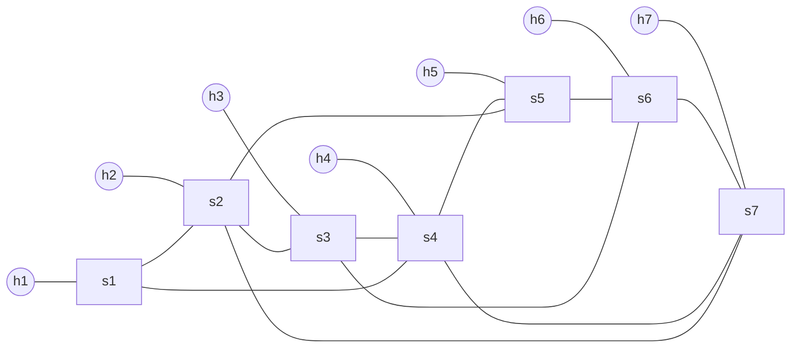
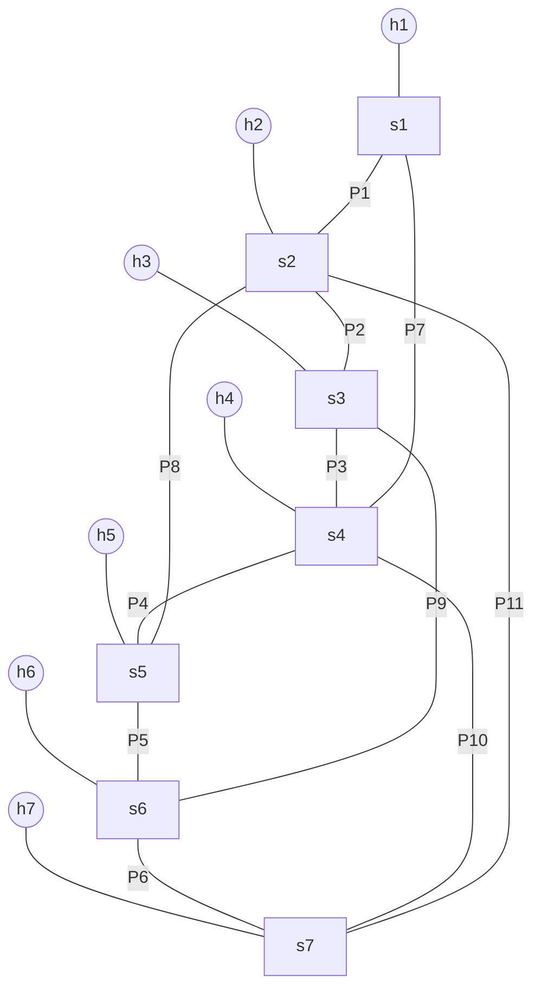

# Complex Topology Demo

This directory provides a larger Mininet topology for the shortest-path switching demo.

## Initial Topology Figure

The topology contains 7 hosts, 7 switches, and 18 links in total.

All hosts in this demo use the `10.0.0.0/24` subnet so the baseline connectivity test is not affected by the standalone firewall rules in `firewall_rule.json`.

- Host links: `h1-s1`, `h2-s2`, `h3-s3`, `h4-s4`, `h5-s5`, `h6-s6`, `h7-s7`
- Switch links: `s1-s2`, `s2-s3`, `s3-s4`, `s4-s5`, `s5-s6`, `s6-s7`, `s1-s4`, `s2-s5`, `s3-s6`, `s4-s7`, `s2-s7`

Figure 1 is the initial graph visualization used by the complex shortest-path test. Hosts and switches are nodes, and all physical links are edges.



## Initial Shortest-Path Reference

The controller uses Dijkstra on an unweighted graph. When there are multiple equal-hop candidates, the implementation visits neighbor switch IDs in ascending order, so the reference paths below match the controller's actual tie-breaking rule.

Because placing all 21 host-pair paths directly on top of one graph would make the figure unreadable, the graph in Figure 1 is paired with the complete path reference table below. This is the comparison baseline for the program output after the initial topology is discovered.

| Host pair | Expected shortest path |
| --- | --- |
| `h1 <-> h2` | `h1 -> s1 -> s2 -> h2` |
| `h1 <-> h3` | `h1 -> s1 -> s2 -> s3 -> h3` |
| `h1 <-> h4` | `h1 -> s1 -> s4 -> h4` |
| `h1 <-> h5` | `h1 -> s1 -> s2 -> s5 -> h5` |
| `h1 <-> h6` | `h1 -> s1 -> s2 -> s3 -> s6 -> h6` |
| `h1 <-> h7` | `h1 -> s1 -> s2 -> s7 -> h7` |
| `h2 <-> h3` | `h2 -> s2 -> s3 -> h3` |
| `h2 <-> h4` | `h2 -> s2 -> s1 -> s4 -> h4` |
| `h2 <-> h5` | `h2 -> s2 -> s5 -> h5` |
| `h2 <-> h6` | `h2 -> s2 -> s3 -> s6 -> h6` |
| `h2 <-> h7` | `h2 -> s2 -> s7 -> h7` |
| `h3 <-> h4` | `h3 -> s3 -> s4 -> h4` |
| `h3 <-> h5` | `h3 -> s3 -> s2 -> s5 -> h5` |
| `h3 <-> h6` | `h3 -> s3 -> s6 -> h6` |
| `h3 <-> h7` | `h3 -> s3 -> s2 -> s7 -> h7` |
| `h4 <-> h5` | `h4 -> s4 -> s5 -> h5` |
| `h4 <-> h6` | `h4 -> s4 -> s3 -> s6 -> h6` |
| `h4 <-> h7` | `h4 -> s4 -> s7 -> h7` |
| `h5 <-> h6` | `h5 -> s5 -> s6 -> h6` |
| `h5 <-> h7` | `h5 -> s5 -> s2 -> s7 -> h7` |
| `h6 <-> h7` | `h6 -> s6 -> s7 -> h7` |

If the controller output differs from this table in the initial stable topology, the difference is a bug in path computation, host discovery, or topology synchronization.

## Report-Oriented Shortest-Path Figure

Figure 2 is a cleaner report-oriented shortest-path explanation figure. It keeps the same initial topology, and uses labeled representative paths to show how the controller selects routes across the graph. The full 21-pair ground truth is still the table above.



Use the labels in Figure 2 together with the following representative shortest paths when presenting the experiment:

- `h1 -> h4`: `h1 -> s1 -> s4 -> h4` using `P7`
- `h1 -> h7`: `h1 -> s1 -> s2 -> s7 -> h7` using `P1 + P11`
- `h2 -> h5`: `h2 -> s2 -> s5 -> h5` using `P8`
- `h3 -> h6`: `h3 -> s3 -> s6 -> h6` using `P9`
- `h4 -> h7`: `h4 -> s4 -> s7 -> h7` using `P10`
- `h5 -> h7`: `h5 -> s5 -> s2 -> s7 -> h7` using `P8 + P11`

These six examples cover the direct shortcut edges (`P7`, `P8`, `P9`, `P10`, `P11`) and make it easy to explain why the remaining host-pair routes in the full table follow the same shortest-hop rule.

## Running

Start the controller first:

```bash
osken-manager --observe-links controller.py
```

Then start the complex topology in another terminal:

```bash
cd tests/complex_topology_test
sudo env "PATH=$PATH" python test_network.py
```

The script prints the same initial shortest-path reference at startup so you can compare it with the controller log side by side.

## Firewall Demo On The Same Topology

To reuse this topology for the firewall demo, start the controller with the complex-topology firewall rule file:

```bash
FIREWALL_RULE_FILE=tests/complex_topology_test/firewall_rule.json osken-manager --observe-links controller.py
```

The supplied firewall rules deny ICMP and TCP/80 traffic between `h1 (10.0.0.2)` and `h2 (10.0.0.3)` in both directions. This demonstrates the required scenario where two hosts that were previously reachable become unreachable after firewall rules are installed.

Suggested verification commands in the Mininet CLI:

```bash
h1 ping -c 2 h2
h2 ping -c 2 h1
h1 ping -c 2 h3
h1 python3 -m http.server 80 &
h2 curl --connect-timeout 2 http://10.0.0.2/
```

Expected results:

- `h1 ping -c 2 h2` fails
- `h2 ping -c 2 h1` fails
- `h1 ping -c 2 h3` still succeeds
- `h2` cannot reach `h1` on TCP/80
- The controller still prints the topology graph and switch shortest paths after topology changes, while the firewall rules make the selected host pair unreachable

## Suggested CLI Demo

After the Mininet CLI appears, run these commands to cover the required topology changes:

1. `pingall`
2. `link s2 s5 down`
3. `link s2 s5 up`
4. `link s4 s7 down`
5. `link s4 s7 up`
6. `switch s7 stop`
7. `switch s7 start`
8. `sh ovs-ofctl mod-port s4 5 down`
9. `sh ovs-ofctl mod-port s4 5 up`

The above sequence exercises these controller callbacks:

- `handle_host_add`: triggered during initialization by gratuitous ARP
- `handle_link_delete`: triggered by `link ... down`
- `handle_link_add`: triggered by `link ... up`
- `handle_switch_delete`: triggered by `switch s7 stop`
- `handle_switch_add`: triggered by `switch s7 start`
- `handle_port_modify`: triggered by `mod-port`

## Port Mapping Note

The script creates host links before switch-switch links, so on `s4` the port layout is expected to be:

- port 1: `h4`
- port 2: `s3`
- port 3: `s5`
- port 4: `s1`
- port 5: `s7`

If your Mininet version numbers ports differently, confirm with `sh ovs-ofctl show s4` before using `mod-port`.